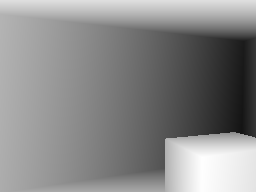
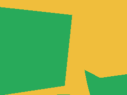
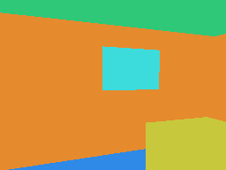

# LieDAR

**It lies to your app about LiDAR.** Run your iOS LiDAR and ARKit capture code on the Simulator.
Replay a recorded capture, or walk a synthetic room.

| Depth | Confidence | Classification |
|---|---|---|
|  |  |  |

That is one frame from a room that does not exist, at 256 by 192, the resolution an iPhone Pro's
LiDAR reports. Metres per pixel on the left, the three confidence bands in the middle, per-face
classification on the right: wall, floor, ceiling, window, table.

```swift
// docs-check: skip
.package(url: "https://github.com/Jolley71717/LieDAR", exact: "0.1.1")
```

## Using it

### Render one depth frame

The smallest useful thing. No files, no capture, just a room and a camera pose.

```swift
import LieDAR
import simd

let room = RoomModel.parametric(.canonical)
let caster = Raycaster(model: room)

// Stand at chest height, two metres in and one across.
var cameraToWorld = matrix_identity_float4x4
cameraToWorld.columns.3 = SIMD4<Float>(2, CameraPath.chestHeight, 1, 1)

let frame = caster.render(cameraToWorld: cameraToWorld, intrinsics: .iPhonePro)
print("\(frame.width) by \(frame.height), \(frame.hitCount) rays hit something")
print("depth is metres, 0 for a miss; confidence is 0 low, 1 medium, 2 high")
```

### Record a whole capture, then read it back

`ScriptedCapture.record` runs a source through the frame gate into a recorder, which writes the
on-disk format in `docs/CAPTURE_FORMAT.md`. Note that frames written is not samples fed: the gate
drops frames the camera did not move far enough for, exactly as a real capture does.

```swift
import Foundation
import LieDAR

let folder = URL.temporaryDirectory.appending(path: "liedar-example")
let source = SyntheticCaptureSource(configuration: .init(seed: 7, seconds: 3))

let report = try await ScriptedCapture.record(from: source, to: folder)
print("fed \(report.samplesSeen) samples, wrote \(report.framesWritten) frames")

let reader = CaptureReader(folderURL: folder)
let manifest = try reader.manifest()
print("\(manifest.frameCount) frames, \(manifest.meshAnchorCount) anchors, \(manifest.totalFaces) faces")
```

### The integration pattern

This is the part that decides whether the package is useful to you. Write your capture code
against `CaptureSource` and never name a concrete source inside it. Then the same code runs
against ARKit on a device and against a synthetic room on the Simulator, and your tests drive the
real path rather than a mock of it.

```swift
import Foundation
import LieDAR

// Your code. It never mentions ARKit or LieDAR's synthetic source.
func record(with source: some CaptureSource, to folder: URL) async throws -> Int {
    guard source.isAvailable else { return 0 }
    return try await ScriptedCapture.record(from: source, to: folder).framesWritten
}

// Your app picks the source once, at the edge, and nothing downstream branches on it.
func makeSource() -> any CaptureSource {
    #if targetEnvironment(simulator)
    return SyntheticCaptureSource(configuration: .init(seed: 1, seconds: 2))
    #else
    return SyntheticCaptureSource(configuration: .init(seed: 1, seconds: 2))  // your ARKit source here
    #endif
}
```

Gate on `source.isAvailable`, never on a static query such as
`ARWorldTrackingConfiguration.supportsSceneReconstruction`. That query is false on every
Simulator, so a static check disables your capture button in the one place this package exists to
help.

### Performance, and the one thing that will surprise you

The raycaster is deliberately on the CPU, with no Metal, so it returns identical bytes on every
arm64 machine. That determinism is what makes byte-exact goldens possible. It costs you nothing
in release and a great deal in debug:

| Build | Time per 256 by 192 depth frame |
|---|---|
| Release | about 10 ms |
| Debug | about 88 ms |

Measured on an M-series Mac. Nine times, which is ordinary for Swift: a debug build keeps bounds
checks, skips inlining and does no cross-function optimisation, and this is a tight loop over
49,152 pixels.

`swift test` and Xcode's test action both build debug by default. If a replay looks too slow to
keep up, check the configuration before you look at anything else. `tools/timing_check.sh`
asserts the release figure against a 20 ms ceiling so a regression is caught rather than noticed.

## What the synthetic source gives you

`SyntheticCaptureSource(seed:)` is a `CaptureSource` with no hardware behind it:

- `RoomModel` builds a parametric room (width, depth, ceiling, doors and windows, a bulkhead,
  furniture, an optional L-shape) meshed into classified triangles, deterministic by seed; or
  any ASCII OBJ.
- `Raycaster` runs on the CPU with no Metal: depth, confidence and a triangle id per pixel, bit-identical on
  every arm64 machine, about 10 ms per 256 by 192 frame in a release build on an M-series Mac.
- `VirtualCamera` walks a scripted path at chest height with a little sway, iPhone Pro intrinsics,
  and a tracking script (`notAvailable` → `limited.initializing` → `normal`, with
  `limited.excessiveMotion` when the script moves too fast).
- `AnchorChunker` emits metre-sized anchors that appear as the camera sees them, grow, overlap,
  are occasionally dropped and re-added under a new id, and all shift at once on a scripted
  loop closure.
- `DegradationModel` leaves 30 % of faces unlabelled, confuses floor with table, and adds per-anchor noise.

- `LieDARUI` draws what that camera sees and lets a person walk it, so a Simulator build shows a
  room rather than a black rectangle. WASD to move, QE or the arrows to turn, RF or the arrows to
  look, on-screen buttons for all of it, and a picker for the three colourings below:

```swift
import LieDARUI
import SwiftUI

// The capture screen of a Simulator build: the room, and the controls to walk it.
struct CaptureScreen: View {
    let source: SyntheticCaptureSource

    var body: some View {
        SimulatorPreview(source: source)
    }
}

// Or, for an app that switches sources, ask the source what to put on screen and let
// CapturePreview work out how to draw it. The screen does not change when the source does.
struct AnySourceScreen: View {
    let source: any CaptureSource

    var body: some View {
        CapturePreview(source.makeCaptureView(), mode: .depth)
    }
}

_ = CaptureScreen(source: SyntheticCaptureSource(seed: 7))
```

  The preview colours a frame with the same table `tools/preview/main.swift` writes the images
  above with, so a screenshot and this readme agree. `docs/PREVIEW.md` has the modes, the
  controls, the wall rules and what the preview deliberately does not do.

`ScriptedCapture.record(from:to:)` runs any source through the same write gate a real
capture uses (`normal` tracking, and at least 0.15 m or 10 degrees or 0.5 s since the last
written frame) into `CaptureRecorder`, so
**`frameCount` is not the number of frames fed**: a 3-second tour at 30 Hz feeds 91 samples and
writes 13 frames. `tools/make_fixture.sh <seed>` writes `Fixtures/synthetic-<seed>/` the same way
and proves two runs are byte-identical; What the source cannot reproduce, meaning sensor noise,
drift, relocalisation, lighting, reflective failures and RoomPlan, is spelled out in
`docs/REALISM.md`.

## The example app

`Example/` is a small capture app built on the package, and the black box the end-to-end tests
drive. Home list, a Start/Stop screen with a live HUD of frames written, anchors held and seconds
elapsed, and a detail screen that reads the saved folder back through `CaptureReader`. The
capture loop in `Example/ExampleApp/CaptureEngine.swift` is the part to copy. It is everything
an adopting app writes between Start and Stop, and nothing in it knows the source is synthetic.

Open `Example/Example.xcodeproj` and run. The project is committed and takes the package as a
local path dependency, so there is no generation step and nothing to fetch. Three XCUITest
journeys drive it on a throwaway simulator:

```
bash tools/journeys.sh          # RESULT: PASS 3 passed/0 failed/0 skipped (...)
bash tools/journey_mutation.sh  # RESULT: PASS 1/1 ...
```

The journeys assert values, not presence: the size the saved row shows must equal the bytes in
the folder, a capture that yielded nothing must add no row at all, and a degraded run must come
back with at least 15 % of its faces unlabelled. `tools/journey_mutation.sh` proves the first one
is load-bearing by deleting the single line that publishes a capture to the list and requiring
the journey to fail on its named assertion, then restoring the file byte-identical. See
`docs/EXAMPLE_APP.md`.

## Do I have to adopt your protocol?

Yes, at the capture boundary, and that is the whole cost. It is worth being blunt about it,
because it is the reason to walk away if you are going to.

ARKit cannot be fed. It has no input path, `ARFrame` and `ARMeshAnchor` have no public
initialisers, and on the Simulator ARKit does not run at all. Nothing can change that. So a
library either replaces ARKit as your app sees it, or it does nothing useful. LieDAR replaces it:
your capture code consumes `CameraSample` and `MeshAnchorPayload` instead of `ARFrame` and
`ARMeshAnchor`.

What that does and does not mean:

- **It is a boundary, not a framework.** One protocol, `CaptureSource`, and a handful of `Sendable`
  value types. Your app's own model, views and storage are untouched. In practice the change is
  confined to the file that owns your `ARSession`.
- **You keep ARKit on device.** Your `ARKitCaptureSource` is yours, it holds a real `ARSession`,
  and it is the one place ARKit appears. LieDAR does not wrap, proxy or intercept it.
- **You can stop at replay.** If you only want your existing recorded captures to run in tests,
  use `CaptureRecorder` and `CaptureReader` and ignore the rest. The synthetic room is optional.
- **The package imports no ARKit at all.** Not one file. It compiles on macOS, where ARKit does
  not exist, which is how its own tests run without a simulator.

If you are not willing to own the source protocol, use a physical device for every test. That is a
legitimate choice and this library is not for you.

## Compatibility

LieDAR does not link ARKit, so an ARKit change cannot break your build through this package. What
an ARKit change can do is make the values it mirrors wrong, and that is what this table is for.

| What LieDAR mirrors | Value it uses | Matches ARKit as of |
|---|---|---|
| Depth map | `Float32` metres, tightly packed, 256 by 192 | iOS 26 |
| Confidence | `UInt8`, 0 low, 1 medium, 2 high, same shape as depth | iOS 26 |
| Mesh classification | `UInt8` raw values 0 to 7: none, wall, floor, ceiling, table, seat, window, door | iOS 26 |
| Camera intrinsics | 3 by 3, column major, pixel origin top left | iOS 26 |
| Frame timestamp | Seconds on a monotonic clock, differences only | iOS 26 |
| Camera transform | 4 by 4 column major, right handed, y up | iOS 26 |

If Apple adds a ninth mesh classification, this package keeps compiling and starts producing data
that is missing a case. That is the failure mode to watch, and it is why the table names a version
rather than claiming to track ARKit.

| | |
|---|---|
| Swift tools | 6.0, language mode 6 |
| Platforms | iOS 16 and later, macOS 13 and later |
| Built and tested against | Xcode 26.1.1 in CI, Xcode 26.5 locally |

**Support policy while this is 0.x.** The minor version is the breaking one: 0.1 to 0.2 may change
the protocol, 0.1.1 to 0.1.2 will not. Pin an exact version. A release that removes something says
so at the top of its notes, and `docs/RELEASE_NOTES.md` keeps the list. Nothing is deprecated
silently. Once the protocol has survived a real adopter it goes to 1.0 and normal semantic
versioning applies.

## What it will never do

- Make ARKit run on the Simulator, or produce ARKit's own types.
- Reproduce sensor noise, drift, relocalisation, lighting or reflective-surface failures with any
  fidelity. Synthetic depth is too clean. `docs/REALISM.md` is specific about each one.
- Test a RoomPlan app. RoomPlan takes an `ARSession` directly and cannot be faced.
- Replace a device. It turns the device lane from the only test into the confirmation, and no
  further than that.

## License

MIT. Fixtures in this repository are generated from parametric rooms; no recorded scan of any
real home is or will be committed.
